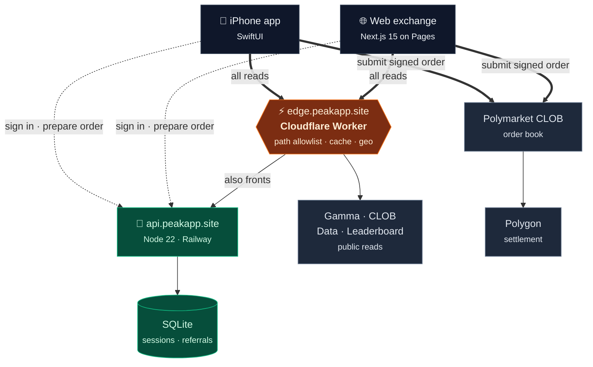
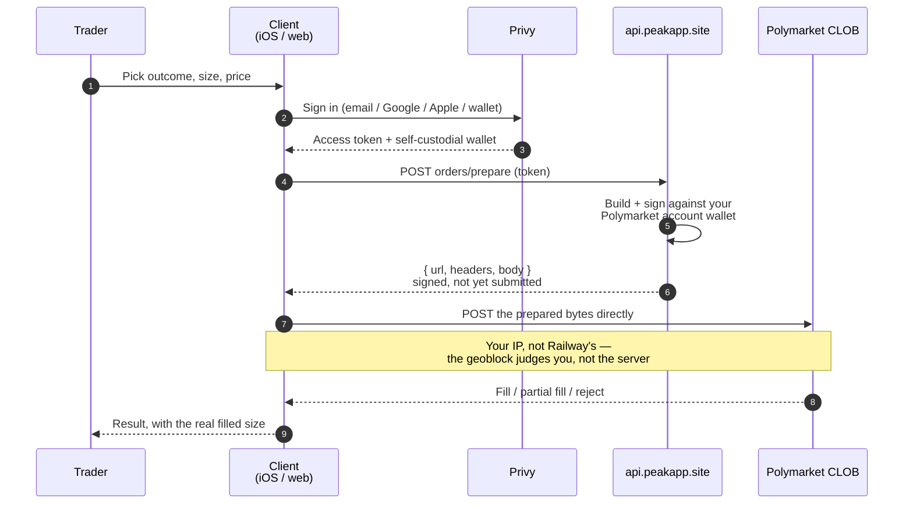
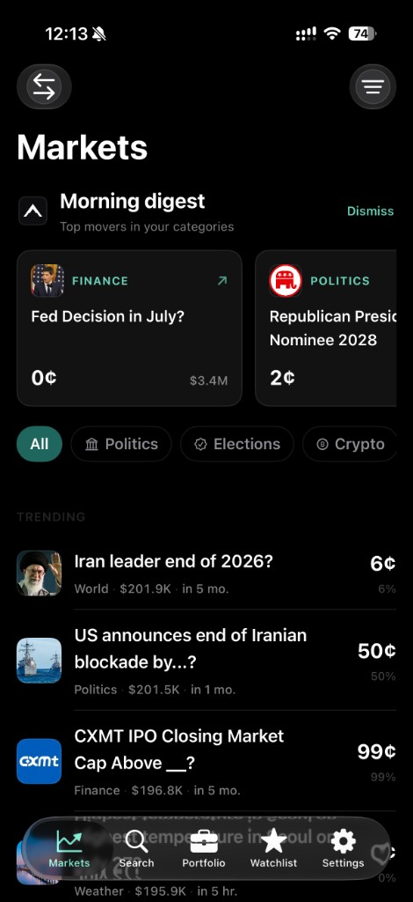
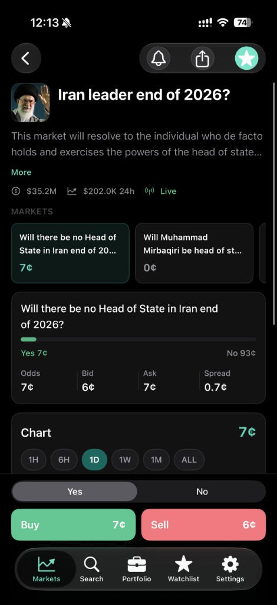
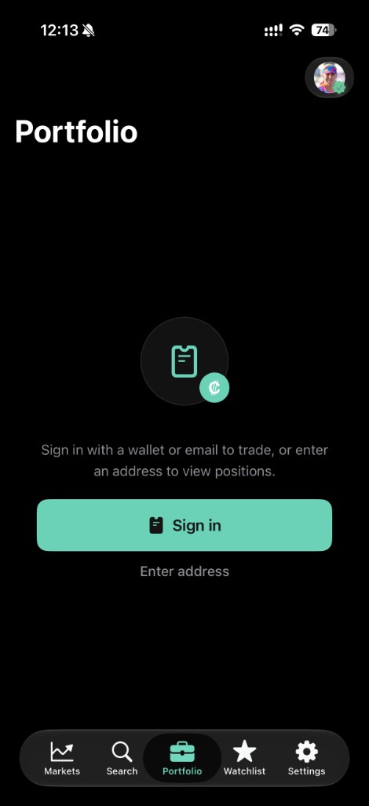
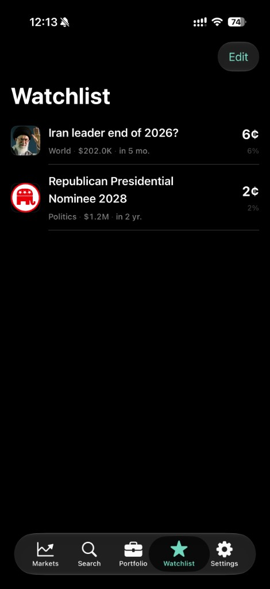

<div align="center">


# Peak

**Prediction markets, without the noise.**

A native iPhone client and a web exchange for [Polymarket](https://polymarket.com) —
live odds, real order books, and self-custodial trading.

[](Peak.xcodeproj)
[](Peak)
[](web)
[](worker)
[](backend)
[](https://polygon.technology)

[Landing](https://peakapp.site) · [Web app](https://app.peakapp.site) · [Changelog](CHANGELOG.md) · [Docs](docs)

</div>

---

## What this is

Peak is an **independent client**. It does not run a market, hold your money, or
take the other side of your trade. Orders rest on Polymarket's own central limit
order book and settle on Polygon; Peak is the interface and the plumbing that
gets you there quickly from a phone or a browser.

The repository holds five deployable surfaces that share one edge:

| Surface | Lives in | Runs at | Deployed with |
| --- | --- | --- | --- |
| **iPhone app** | [`Peak/`](Peak) · [`PeakWidget/`](PeakWidget) | TestFlight / App Store | Xcode Archive → Transporter |
| **Web exchange** | [`web/`](web) | [app.peakapp.site](https://app.peakapp.site) | `npm run pages:deploy` |
| **Landing page** | [`website/`](website) | [peakapp.site](https://peakapp.site) | `wrangler pages deploy website` |
| **Edge proxy** | [`worker/`](worker) | `edge.peakapp.site` · `api.peakapp.site` | `wrangler deploy` |
| **Trading API** | [`backend/`](backend) | `api.peakapp.site` (Railway) | `railway up` |

> **Nothing deploys on push.** There is no CI in this repository — every surface
> ships by hand, deliberately. `main` is the source of truth, not a release
> trigger.

---

## Architecture

Everything a client reads goes through **one Cloudflare Worker**. That is not a
performance flourish — Indian ISPs block `*.polymarket.com` at the TLS layer, so
the browser and the app must never send that SNI at all. The Worker terminates
the connection on a domain that resolves, then talks to Polymarket itself.



Two paths, and the difference matters. **Every read** goes through the Worker.
**Order submission does not** — the client posts the signed order straight to
Polymarket, for the reason in the sequence below.

### Why the Worker exists

It solves four problems at once, which is why it is not optional:

1. **Reachability.** `*.polymarket.com` and `*.up.railway.app` fail to resolve on
   Indian ISP resolvers. `edge.peakapp.site` and `api.peakapp.site` are custom
   domains on a zone that does.
2. **CORS.** Polymarket's endpoints do not send permissive CORS headers. The
   Worker does, so a browser can read the same data the app does with no
   server-side rendering in the path.
3. **Caching.** Fat `/events` payloads are collapsed per-path (2s for top-of-book,
   60s for market lists), so a thundering herd hits Polymarket once.
4. **Geo.** Cloudflare sees the real client IP; the API backend only ever sees
   its own. Eligibility has to be resolved where the truth is.

Reads are **path-allowlisted** — the Worker is a narrow proxy, not an open one.

### Placing an order — Peak signs, your device posts

The order is **signed on Peak's server but submitted from your own device**.
That split is deliberate, and it is the single most load-bearing decision in the
trading path: Polymarket's geoblock reads the IP of whoever posts the order. If
the server submitted, every order would carry Railway's IP and be judged on the
server's location rather than yours.



Two consequences that look like quirks until you know why:

- **The prepared body is sent verbatim.** It is never re-serialized, because the
  L2 HMAC covers the exact bytes. Re-encoding identical JSON breaks the
  signature.
- **Partial fills are reported as partial fills.** Where a number cannot be
  resolved honestly, the client reports nothing rather than a plausible-looking
  figure.

---

## The iPhone app

<div align="center">
  
  
  
  
</div>

67 Swift files, SwiftUI throughout, Apple HIG with iOS 26 Liquid Glass gated
behind `#available`. Five tabs: **Markets · Search · Portfolio · Watchlist ·
Settings**, plus a leaderboard sourced from the same host that backs
polymarket.com/leaderboard.

```bash
# 1. Secrets stay out of tracked Info.plist
cp Peak/PrivySecrets.local.example.plist Peak/PrivySecrets.local.plist
#    → fill Privy app id + WALLETCONNECT_PROJECT_ID (Reown Cloud)

# 2. Open, set your Development Team, run
open Peak.xcodeproj
```

Xcode 16+ / iOS 18+. For a local backend during DEBUG, see
[`backend/README.md`](backend/README.md); a physical device must point at your
Mac's LAN IP, not `127.0.0.1`.

**Shipping a build:** bump `CURRENT_PROJECT_VERSION` first — App Store Connect
rejects a build number it has already accepted. Full archive, export and upload
steps, plus the two vendor workarounds this app carries (PrivySDK's unsigned
XCFramework, Sentry dSYM linking), are in
**[docs/APP_STORE.md](docs/APP_STORE.md)** and
**[docs/RELEASE.md](docs/RELEASE.md)**.

---

## The web exchange

Next.js 15 App Router on Cloudflare Pages via `@cloudflare/next-on-pages`.
Markets browse two levels deep — Sports opens into Soccer, Cricket, NFL,
Basketball and nine more — with incremental loading, a live order book, a price
chart, and a trade ticket.

```bash
cd web
cp .env.example .env.local        # NEXT_PUBLIC_PRIVY_APP_ID, edge URL
npm install
npm run dev                       # http://localhost:3000
```

| Task | Command |
| --- | --- |
| Type check | `npm run typecheck` |
| Production build | `npm run build` |
| Pages build (what actually ships) | `npm run pages:build` |
| Deploy | `npm run pages:deploy` |

> **Build with `pages:build` before deploying.** It is a different code path
> from `next build` and is where edge-runtime and browser-support problems
> surface. A plain `next build` passing is not evidence the deploy is safe.

Three routes must not break, and are checked after every deploy:
`/.well-known/apple-app-site-association` (universal links), `/invite/[code]`
(referrals), and the `peakapp.site/legal/*` links (App Store review).

---

## The edge Worker

```bash
cd worker
npx wrangler dev --port 8787 --local
npx wrangler deploy
```

Fronts four Polymarket hosts plus Peak's own API. Adding an upstream means
adding it to both `UPSTREAMS` and the `ROUTES` allowlist in
[`worker/src/index.js`](worker/src/index.js) — an unlisted path is refused, by
design.

## The trading API

```bash
cd backend
cp .env.example .env              # Builder / Relayer / RPC credentials
npm start                         # :8080
npm test                          # node --test
npm run check                     # syntax + alignment + trading smoke
```

Node 22, no build step. Persistence is `node:sqlite` from Node core rather than
`better-sqlite3` — the Dockerfile is `node:22-alpine` with no build toolchain,
and a native module would not compile there.

---

## Custody and safety

- **Peak never holds funds.** Email and social sign-in create a self-custodial
  wallet through Privy; orders settle to your own Polymarket account wallet.
- **Server-side signing is scoped.** The backend signs orders you asked for
  against your own account, and nothing else. It is not a hot wallet.
- **The web client never touches private keys.** No key or seed-phrase input
  exists on web, and that is a standing rule rather than an unbuilt feature.
- **Geoblocks are respected, not routed around.** Restricted regions are
  disabled up front with an explanation instead of failing after a round trip;
  close-only regions can still exit. The country list in the Worker is a
  point-in-time snapshot — CLOB's own rejection stays authoritative.

---

## Repository layout

```
Peak/                 iOS app — SwiftUI, 67 files
├─ Features/          Markets, Search, Portfolio, Watchlist, Settings, Leaderboard, Share
├─ Services/          Trading, referrals, crash reporting
├─ Networking/        Gamma / CLOB / Data / leaderboard clients
├─ Models/            Domain types, flexible decoders for Gamma's loose shapes
└─ DesignSystem/      Themes, colour ramps, contrast helpers

PeakWidget/           Home-screen widget
web/                  Next.js 15 web exchange
├─ app/               App Router pages + the /invite and /api proxy routes
├─ components/        Market rows, event terminal, trade ticket, order book
└─ lib/               Gamma / CLOB clients, taxonomy, session, theme

website/              Static landing page + legal pages
worker/               Cloudflare Worker — the shared edge
backend/              Node trading API, sessions, referrals
docs/                 Production, App Store, release and web-client runbooks
scripts/              Build-time helpers (PrivySDK signing)
```

---

## Documentation

| Document | What it covers |
| --- | --- |
| [docs/PRODUCTION.md](docs/PRODUCTION.md) | Environment, hosted config, the production checklist |
| [docs/APP_STORE.md](docs/APP_STORE.md) | Submission, vendor workarounds, Sentry symbols |
| [docs/RELEASE.md](docs/RELEASE.md) | TestFlight and release cadence |
| [docs/XCODE_CLOUD.md](docs/XCODE_CLOUD.md) | Archiving from a beta-Xcode Mac |
| [docs/WEB_CLIENT.md](docs/WEB_CLIENT.md) | Web landing + client plan and deploys |
| [CHANGELOG.md](CHANGELOG.md) | What changed, and which failure each fix addressed |

---

## Status

Honest, not aspirational.

| Area | Status |
| --- | --- |
| Browse markets, charts, order book (iOS + web) | **Live** |
| Web exchange on `app.peakapp.site` | **Live** |
| Sign-in — email, Google, Apple, wallet | **Live** |
| Portfolio, positions, open orders, activity | **Live** |
| Buy / sell / cancel | **Live** — real orders filled end to end from a TestFlight build against production |
| Referrals and invite links | **Live** — universal links land in the app |
| Leaderboard | **Live** — matches polymarket.com's own board |
| iPhone app on TestFlight | **Live** |
| App Store | **Not yet submitted** — the archive and upload path are proven by TestFlight |

Worth noting what the device fill confirms: orders are signed on Peak's server
but **submitted from the device**, so Polymarket's geoblock reads the trader's
IP rather than Railway's. A server-side submit would be judged on the server's
location. That is the split drawn in
[Placing an order](#placing-an-order--peak-signs-your-device-posts), and it is
the reason a device can trade where the backend alone could not.

---

<div align="center">

Peak is an independent client and is **not affiliated with Polymarket, Inc.**

Prediction markets carry real financial risk. Nothing here is financial advice.

</div>
