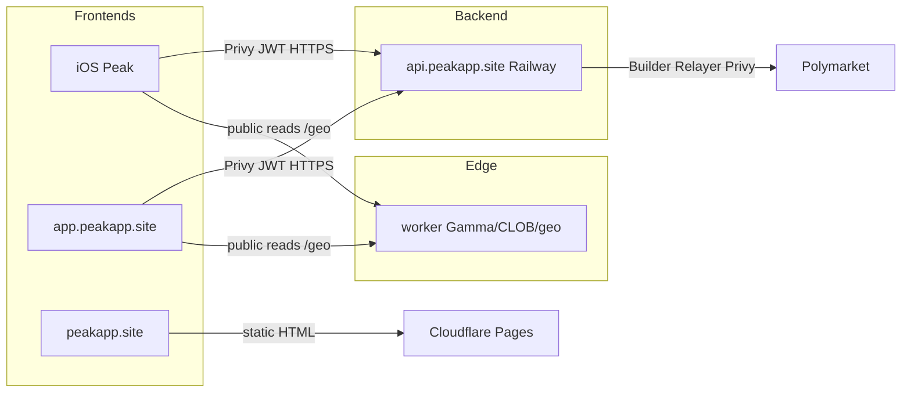

# Peak web client + landing (post–iOS launch)

Plan for a browser landing page and exchange UI that share the existing Railway API with the iOS app. **Do not start until iOS is on TestFlight / App Store** — keep focus on native ship first.

Credentials, CORS env details, and E2E paths live in [PRODUCTION.md](PRODUCTION.md). Release cadence: [RELEASE.md](RELEASE.md). Store packaging: [APP_STORE.md](APP_STORE.md). Static site today: [`website/`](../website/).

## Decisions (locked 2026-08-05)

| Question the earlier draft left open | Decision |
| --- | --- |
| Framework | **Next.js**, for SSR. Market pages are search-discoverable content; an SPA would leave that traffic on the table. |
| Hosting | **Cloudflare Pages**, same account and deploy flow as `website/`. |
| v1 scope | **Browse + Privy trade.** Markets SSR from the edge Worker; auth/orders via Peak API (`web/`). |
| Private key / seed import on web | **Never. Not in v1, not later.** See below. |

### Web is Privy-only. No key import, ever.

On iOS the import path is defensible: the binary is signed, Apple distributes
it, and impersonating it is hard. None of that holds in a browser.

- A malicious extension can read the page's DOM, including a seed input.
- One XSS bug anywhere on the origin reaches the same field.
- A visually identical clone of this domain costs an attacker almost nothing,
  and users cannot tell the difference. Most crypto theft is this, not broken
  cryptography.

So the web client offers Privy sign-in only. A user who wants to trade an
existing Polymarket wallet uses the iOS app. The upside is that the web client
is then genuinely non-custodial — Peak's servers never hold a signing key for a
web user, which is a simpler and stronger story than the one we can tell on iOS.

If this is ever revisited, it needs its own threat model, not a parity argument.

## Goals / when to start

| Goal | Notes |
| --- | --- |
| Brand landing on apex | Marketing home + App Store CTA; legal already under `website/legal/` |
| Web exchange on subdomain | Browse → auth → trade against the same backend as iOS |
| One backend, two frontends | No second trading API; reuse Railway `api.peakapp.site` |
| Timing | **After** TestFlight / Store launch smoke is green |

Out of scope for day one: native web parity with every iOS polish, admin tools, or a separate trading stack.

## Domain layout

Prefer same brand domain; apex for landing, `app` for the client, `api` already live.

| Host | Role | Hosting |
| --- | --- | --- |
| `peakapp.site` | Landing + legal (`/legal/*`) + AASA + invites | Cloudflare Pages (`website/` → `peak-website`) |
| `www.peakapp.site` | Redirect → apex | Cloudflare |
| `app.peakapp.site` | Web trading client (Next.js) | Cloudflare Pages (`web/` → `peak-web`) |
| `api.peakapp.site` | Existing trading / auth API | Railway (unchanged) |
| `edge.peakapp.site` | Public Gamma / CLOB / `/geo` Worker | `worker/` → `peak-edge` |

**Apex is live and stays on `peak-website`.** Do not attach `peakapp.site` to
`peak-web` — that would replace the marketing homepage. The web client lives
only on `app.peakapp.site`. Browser→API CORS can stay off; the Next app proxies
via `/api/peak/*`. If you ever call the API from the browser directly, set
`CORS_ORIGINS=https://app.peakapp.site`.

### DNS for `app` (required once)

Pages already has custom domain **`app.peakapp.site`** registered on `peak-web`
(status pending until DNS exists). Wrangler OAuth is often **zone read-only**,
so create the record in the Cloudflare dashboard:

1. Cloudflare → **DNS** → zone **`peakapp.site`**
2. **Add record**:

   | Type | Name | Target | Proxy status |
   | --- | --- | --- | --- |
   | CNAME | `app` | `peak-web-dq7.pages.dev` | Proxied (orange cloud) |

3. Wait for Pages → Custom domains → `app.peakapp.site` → **Active** (SSL via
   Google CA). Until then the hostname is **NXDOMAIN**.

Do **not** point apex at `peak-web`.

## Deploy (web beside landing)

1. `npx wrangler pages deploy website --project-name peak-website` — refresh
   landing CTAs (“Launch app” → `https://app.peakapp.site`).
2. `cd web && npm run pages:deploy` — create/update `peak-web` (build with
   `NEXT_PUBLIC_PRIVY_APP_ID` in the environment / `.env.local`).
3. Pages → `peak-web` → Compatibility flags → **`nodejs_compat`** (Production +
   Preview) — already set on current project.
4. Pages → `peak-web` → Custom domains → **`app.peakapp.site`** + DNS CNAME above.
5. Pages env (Production + Preview): `NEXT_PUBLIC_PRIVY_APP_ID`,
   `NEXT_PUBLIC_PEAK_EDGE_URL`, `PEAK_API_URL`, and matching
   `PEAK_WEB_PROXY_SECRET` (also `wrangler secret put` on `peak-edge`).
6. Privy Dashboard → Allowed origins checklist (below).

Step-by-step + verify table: [WEB_DEPLOY_PROMPT.md](WEB_DEPLOY_PROMPT.md).

### Privy allowlist checklist

| Origin | Required? |
| --- | --- |
| `https://app.peakapp.site` | **Yes** (production web) |
| `https://peak-web-dq7.pages.dev` | **Yes** until custom domain is Active (smoke / fallback) |
| `http://localhost:3000` | Yes for local `npm run dev` |
| `https://peakapp.site` | **No** when “Launch app” is a normal navigation to `app.` — apex does not load Privy. Add only if marketing ever embeds Privy or opens an auth popup from the apex origin. |

Auth uses Privy JWT Bearer via `/api/peak/*` (same as iOS). HttpOnly cookie sync
across `*.peakapp.site` is **not** required for v1. If you later enable Privy
HttpOnly cookies, set the app domain to `peakapp.site` in the Dashboard and
complete Privy’s DNS verification — still keep the trading UI on `app.`.

External wallets (MetaMask etc.) are configured for **Polygon** (`defaultChain`
137). Order signing stays on Peak’s server; the browser only posts the prepared
CLOB body.

## Architecture

- **Secrets stay on Railway** (Privy app secret, Builder, Relayer, `PEAK_PRIVY_AUTH_KEY`). Browser gets only public Privy app id + API base URL.
- Web and iOS call the same routes; CORS allow-lists the web origin only when the SPA ships.

## Reuse vs build new

| Reuse (existing) | Build new |
| --- | --- |
| `backend/` on Railway — auth, setup, orders, legal 301s | Web SPA (React/Next or similar — pick at build time) |
| Privy multi-user mode + server wallet signing | Privy **Web** SDK login (email / social / wallet) |
| `worker/` public Gamma/CLOB + `/geo` | Landing polish on `website/index.html` |
| `website/legal/*` copy | CORS: set `CORS_ORIGINS=https://app.peakapp.site` (and local dev origin) |
| Geo gate idea (disable trade UX when restricted) | Web geo UX via Worker `/geo` (browser IP), same country list spirit as iOS |
| App Store link / support mailto | Optional: wallet connect redirect allow-list for `app.peakapp.site` in Privy / Reown |

Do **not** put Builder keys, Relayer keys, `PRIVY_APP_SECRET`, or `PEAK_PRIVY_AUTH_KEY` in the SPA bundle.

## Phased plan

### 0 — SSL + landing shell — **done (2026-08-05)**

1. ~~Fix Cloudflare custom-domain SSL~~ — apex resolves; the 525 is gone.
2. ~~Point Pages custom domain; restore `WEBSITE_ORIGIN` + Info.plist legal URLs~~ — both on the apex.
3. Apex serves marketing, `/legal/*`, and `/.well-known/apple-app-site-association`.

### 1 — Browse (read-only web) — **done in `web/`**

Next app under `web/`: markets list, event detail with SSR metadata, search,
invite route, legal mirrors. Reads Worker (`edge.peakapp.site`). Production host
is **`app.peakapp.site`**; apex marketing stays on `peak-website`.

### 2 — Auth — **done in `web/`**

1. Privy Dashboard: add web origins (`https://app.peakapp.site`, Pages preview,
   `http://localhost:3000`).
2. Optional: set host `CORS_ORIGINS=https://app.peakapp.site` for direct
   browser→API. The web app proxies via `/api/peak/*` so CORS is not required
   for the Next client.
3. Email / Google / Apple / wallet SIWE via Privy Web; API verifies Privy JWT.
4. Session sync + trading setup with retry toast on failure.

### 3 — Trade — **done in `web/` (ops still required)**

1. Portfolio, setup, prepare/submit order path wired in `web/` (Privy path
   `new` only — no seed import).
2. Market (FOK/FAK) + limit (GTC) ticket; live bid/ask/spread from edge CLOB.
3. Open orders + cancel; deposit address copy; position → sell deep-link.
4. Geo gate from Worker `/geo` disables buy/sell in the ticket UI.
5. `/api/peak/*` can forward browser CF country when `PEAK_WEB_PROXY_SECRET`
   matches on Pages + Worker (otherwise API region gate may see the colo).
6. Smoke in allowed regions still required before marketing web trading.

### 4 — Polish

1. Landing “Launch app” → `https://app.peakapp.site`; iOS share/QR market links
   use the same base.
2. Align error copy with iOS (“backend not configured”, geo messages).
3. Monitoring (optional Sentry browser); document deploy next to RELEASE.md cadence.

## Smoke test checklist (web)

Run against `https://app.peakapp.site` (or local `npm run dev`) from an
**allowed** region. Skip live order submit if geo-blocked.

1. **Browse** — `/markets` loads cards; category + sort change URL; pagination
   works; search returns events.
2. **Detail** — open an event; bid/ask/spread refresh on the ticket.
3. **Auth** — Sign in (email or Google); portfolio shows signer; geo banner
   matches `/geo` if restricted.
4. **Setup** — if “Needs setup”, Finish setup succeeds (Builder/Relayer live).
5. **Deposit** — Portfolio shows deposit wallet; Copy address works.
6. **Limit buy** — small GTC buy prepare → submit → success or clear CLOB/
   balance error (never silent 404→Railway fallback except missing prepare).
7. **Market sell** — from a position link (`?side=SELL&shares=…`) or ticket;
   order type shows FAK.
8. **Orders** — open GTC appears under Open orders; Cancel removes it.
9. **Geo** — in a blocked region, buy disabled with clear copy; close-only
   allows sell only.
10. **Landing intact** — `https://peakapp.site/` still marketing; Launch app →
    `app.peakapp.site`.

## Remaining ops (not code)

| Item | Who | Status notes |
| --- | --- | --- |
| Privy origins: `app.peakapp.site` + `peak-web-dq7.pages.dev` + localhost | Privy Dashboard | User: `app.` done; still add pages.dev + localhost if missing |
| DNS CNAME `app` → `peak-web-dq7.pages.dev` (proxied) | Cloudflare DNS UI | Wrangler OAuth lacks zone **write** — dashboard required |
| Pages `nodejs_compat` + env (`PRIVY`, `PEAK_API_URL`, proxy secret) | Pages | Set on project; redeploy after `NEXT_PUBLIC_*` changes |
| Worker `PEAK_WEB_PROXY_SECRET` (same value as Pages) | Wrangler | Required for honest geo on `/api/peak/*` |
| Live order submit smoke | Human | From an **allowed** region (India/`IN` is blocked — use VPN / allowed ISP). Browse + sign-in still work while blocked. |
| App Store public URL once listed | Replace landing CTA | |

## CORS / Privy / geo (Peak-specific)

- **CORS:** iOS needs none. Web needs an explicit allow-list — never `*`, never production `http://`. Recommended production value when SPA is live: `https://app.peakapp.site`. Detail: [PRODUCTION.md § CORS](PRODUCTION.md#cors-local-vs-production).
- **Privy:** Same app as iOS where possible; configure Web client + allowed origins. Server still holds `PRIVY_APP_SECRET` / auth key. Client only embeds public app id.
- **Geo:** Worker `/geo` sees the real client IP (Railway alone does not). Web must call `/geo` from the browser (or a Worker-fronted path), not assume the API’s egress IP. For `/api/peak/*`, set matching `PEAK_WEB_PROXY_SECRET` on Pages + Worker so prepare/submit region headers use the browser country. Restricted / close-only behavior should match iOS intent — Peak does not circumvent Polymarket geoblocks. See README Regions + [polymarket-builder-geoblock-email.md](polymarket-builder-geoblock-email.md) for server-side nuance.

## Out of scope / risks

| Out of scope (v1) | Risk |
| --- | --- |
| Replacing iOS as primary product | Apex SSL unfixed → broken brand URLs |
| Second backend or duplicated Builder keys in frontend | CORS too wide → browser abuse of API |
| Circumventing geo / spoofing client country | Privy origin misconfig → broken login |
| Full feature parity on day one | Trading from restricted regions still fails at CLOB |
| Committing env secrets into `website/` or SPA | Session / cookie CSRF if auth cookies ever used — prefer Bearer JWT like iOS |

## Links

- [PRODUCTION.md](PRODUCTION.md) — credentials, CORS, E2E, SSL note
- [RELEASE.md](RELEASE.md) — API vs iOS ship; web is API + static, no Store round-trip
- [APP_STORE.md](APP_STORE.md) — Store packaging; web is separate
- [`website/`](../website/) — landing + legal HTML on Pages
- [backend/README.md](../backend/README.md) — local API / device smoke
- [worker/README.md](../worker/README.md) — edge proxy + geo
