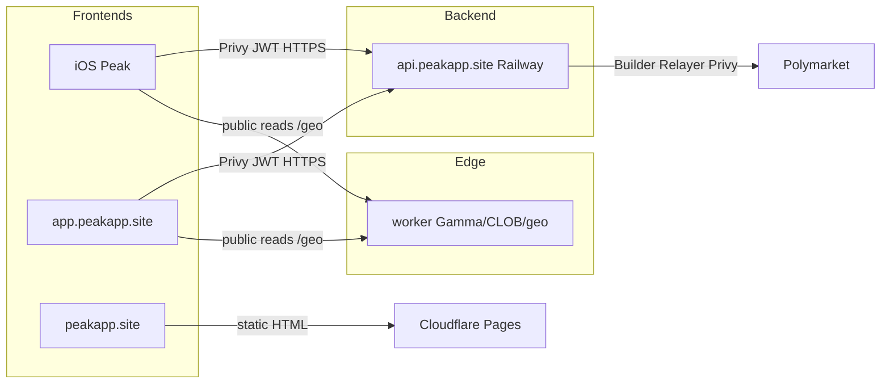

# Peak web client + landing (post–iOS launch)

Plan for a browser landing page and exchange UI that share the existing Railway API with the iOS app. **Do not start until iOS is on TestFlight / App Store** — keep focus on native ship first.

Credentials, CORS env details, and E2E paths live in [PRODUCTION.md](PRODUCTION.md). Release cadence: [RELEASE.md](RELEASE.md). Store packaging: [APP_STORE.md](APP_STORE.md). Static site today: [`website/`](../website/).

## Goals / when to start

| Goal | Notes |
| --- | --- |
| Brand landing on apex | Marketing home + App Store CTA; legal already under `website/legal/` |
| Web exchange on subdomain | Browse → auth → trade against the same backend as iOS |
| One backend, two frontends | No second trading API; reuse Railway `api.peakapp.site` |
| Timing | **After** TestFlight / Store launch smoke is green |

Out of scope for day one: native web parity with every iOS polish, admin tools, or a separate trading stack.

## Domain layout

Prefer same brand domain; apex for landing, `app` for the client, `api` already live.

| Host | Role | Hosting (planned) |
| --- | --- | --- |
| `peakapp.site` | Landing + legal (`/legal/*`) | Cloudflare Pages (`website/`) |
| `www.peakapp.site` | Redirect → apex | Cloudflare |
| `app.peakapp.site` | Web client (SPA) | Pages / static + CDN (TBD) |
| `api.peakapp.site` | Existing trading / auth API | Railway (unchanged) |

**Blocker first:** apex SSL is Cloudflare **525** today. Legal temporarily uses `peak-website-88n.pages.dev` — see PRODUCTION.md. Fix custom-domain SSL, then retarget `WEBSITE_ORIGIN` / plist URLs to `https://peakapp.site` before leaning on apex marketing.

## Architecture

- **Secrets stay on Railway** (Privy app secret, Builder, Relayer, `PEAK_PRIVY_AUTH_KEY`). Browser gets only public Privy app id + API base URL.
- Web and iOS call the same routes; CORS allow-lists the web origin only when the SPA ships.

## Reuse vs build new

| Reuse (existing) | Build new |
| --- | --- |
| `backend/` on Railway — auth, setup, orders, legal 301s | Web SPA (React/Next or similar — pick at build time) |
| Privy multi-user mode + server wallet signing | Privy **Web** SDK login (email / social / wallet) |
| `worker/` public Gamma/CLOB + `/geo` | Landing polish on `website/index.html` |
| `website/legal/*` copy | CORS: set `CORS_ORIGINS=https://app.peakapp.site` (and local dev origin) |
| Geo gate idea (disable trade UX when restricted) | Web geo UX via Worker `/geo` (browser IP), same country list spirit as iOS |
| App Store link / support mailto | Optional: wallet connect redirect allow-list for `app.peakapp.site` in Privy / Reown |

Do **not** put Builder keys, Relayer keys, `PRIVY_APP_SECRET`, or `PEAK_PRIVY_AUTH_KEY` in the SPA bundle.

## Phased plan

### 0 — SSL + landing shell

1. Fix Cloudflare custom-domain SSL for `peakapp.site` / `www` (clear 525).
2. Point Pages custom domain; restore `WEBSITE_ORIGIN` + Info.plist legal URLs to apex.
3. Ship a minimal apex landing (brand, one CTA to App Store / later web). Keep legal paths as today.

### 1 — Browse (read-only web)

1. Stand up `app.peakapp.site` shell; markets list, event, chart / book via `worker/` (or same public paths iOS uses).
2. No auth required. Geo banner optional (informational).
3. Leave `CORS_ORIGINS` empty until the SPA calls the API with credentials.

### 2 — Auth

1. Privy Dashboard: add web origin `https://app.peakapp.site` (+ localhost for dev).
2. Set host `CORS_ORIGINS` to that HTTPS origin (comma-separate with local if needed). Keep empty for iOS-only until then — see PRODUCTION.md CORS table.
3. Email / Google / Apple / wallet SIWE via Privy Web; API continues to verify Privy JWT. No secrets in browser.

### 3 — Trade

1. Wire portfolio, path choice (new vs existing), setup, place / cancel through existing `backend/` routes.
2. Enforce geo gate in UI from Worker `/geo` before enabling order actions (CLOB rejection remains authoritative).
3. Smoke A/B paths from PRODUCTION.md on desktop browsers in allowed regions.

### 4 — Polish

1. Mobile web layout; deep links from landing → app subdomain.
2. Align error copy with iOS (“backend not configured”, geo messages).
3. Monitoring (optional Sentry browser); document deploy next to RELEASE.md cadence.

## CORS / Privy / geo (Peak-specific)

- **CORS:** iOS needs none. Web needs an explicit allow-list — never `*`, never production `http://`. Recommended production value when SPA is live: `https://app.peakapp.site`. Detail: [PRODUCTION.md § CORS](PRODUCTION.md#cors-local-vs-production).
- **Privy:** Same app as iOS where possible; configure Web client + allowed origins. Server still holds `PRIVY_APP_SECRET` / auth key. Client only embeds public app id.
- **Geo:** Worker `/geo` sees the real client IP (Railway alone does not). Web must call `/geo` from the browser (or a Worker-fronted path), not assume the API’s egress IP. Restricted / close-only behavior should match iOS intent — Peak does not circumvent Polymarket geoblocks. See README Regions + [polymarket-builder-geoblock-email.md](polymarket-builder-geoblock-email.md) for server-side nuance.

## Out of scope / risks

| Out of scope (v1) | Risk |
| --- | --- |
| Replacing iOS as primary product | Apex SSL unfixed → broken brand URLs |
| Second backend or duplicated Builder keys in frontend | CORS too wide → browser abuse of API |
| Circumventing geo / spoofing client country | Privy origin misconfig → broken login |
| Full feature parity on day one | Trading from restricted regions still fails at CLOB |
| Committing env secrets into `website/` or SPA | Session / cookie CSRF if auth cookies ever used — prefer Bearer JWT like iOS |

## Links

- [PRODUCTION.md](PRODUCTION.md) — credentials, CORS, E2E, SSL note
- [RELEASE.md](RELEASE.md) — API vs iOS ship; web is API + static, no Store round-trip
- [APP_STORE.md](APP_STORE.md) — Store packaging; web is separate
- [`website/`](../website/) — landing + legal HTML on Pages
- [backend/README.md](../backend/README.md) — local API / device smoke
- [worker/README.md](../worker/README.md) — edge proxy + geo
